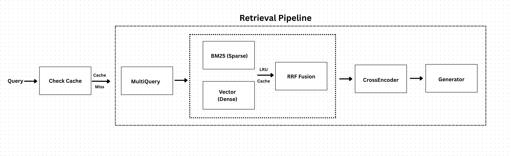
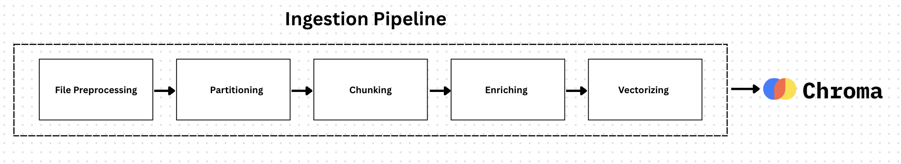

# DeepRecall

DeepRecall is a Retrieval-Augmented Generation (RAG) system for answering questions over PDF documents. It focuses on accurate retrieval, fast responses, and clear source attribution.

## Highlights

- Hybrid retrieval (BM25 + vector search) with RRF fusion
- Multi-query expansion for better recall
- Two-tier caching (retrieval + answer caches) with LRU/TTL
- Streaming/real-time answers via WebSockets
- Semantic chunking to preserve document structure
- Modular codebase for easy extension

## Architecture




## Demo

https://github.com/user-attachments/assets/98f42624-295e-41c5-9aae-744205db482d

## Quick Start

1. Backend

	 - Install dependencies:

		 ```bash
		 pip install -r backend/requirements.txt
		 ```

	 - Start the server (example):

		 ```bash
		 python backend/server.py
		 ```

2. Frontend

	 - Install and run:

		 ```bash
		 npm install
		 npm run dev
		 ```

3. Ingest a PDF and ask questions via the UI or the endpoints below.

## Minimal API Summary

- POST /ingest — Upload a PDF (multipart/form-data). Returns ingestion status and created chunks.
- POST /chat/stream — Streamed Q&A: send `{ query, collection_name }` and receive streaming tokens/events.
- GET /health — Health check
- GET /cache/stats — Cache metrics
- POST /cache/clear — Clear caches
- GET /benchmarks — System performance stats


## 📊 Observability

Integrated monitoring through:

- **LangSmith**: LLM call tracing and prompt inspection
- **Weights & Biases**: Model performance tracking
- **Custom Benchmarks**: Latency, cache hit rates, error rates

## 🏛️ Other Projects

Check out my other projects [here](https://github.com/Khadka-Bishal).

## 🔗 Connect

[](https://www.linkedin.com/in/khadka-bishal/)
