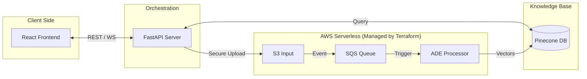
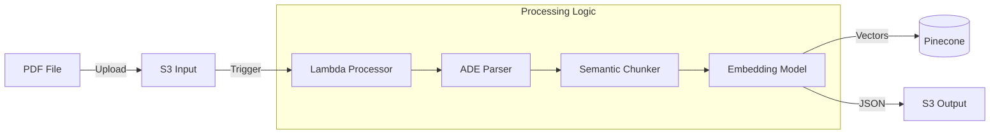
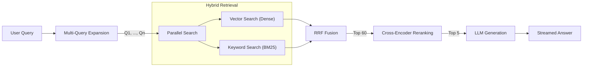

DeepRecall is a hybrid Retrieval-Augmented Generation (RAG) system that uses AWS Lambda for document processing. It separates the "Write Path" (heavy lifting) from the "Read Path" (latency-sensitive chat).

## Technical Overview

-   **Hybrid Search**: Combines BM25 (keyword) and Dense Vector search with Reciprocal Rank Fusion (RRF).
-   **Architecture**:
    -   **Ingestion (Write)**: Event-driven AWS Pipeline (S3 → Lambda → Pinecone).
    -   **Retrieval (Read)**: FastAPI backend querying Pinecone directly.
-   **Infrastructure as Code**: Fully provisioned AWS environment (IAM, S3, Lambda, SQS) using Terraform modules.

## System Architecture

### High-Level Architecture

The system is deployed across a hybrid environment, with infrastructure managed via **Terraform**.

### Detailed Data Flow

The system implements an **Asynchronous Write Path** (Upload -> S3 -> Lambda -> Pinecone) and a **Synchronous Read Path** (User -> API -> Pinecone).

View Sequence Diagram

### Ingestion Pipeline (Write Path)

Handles high-scale document processing using an event-driven serverless architecture:

### Retrieval Pipeline (Read Path)

DeepRecall employs a "Fusion Retrieval" strategy to ensure high recall and precision:

## Quick Start
1.  **Backend**: `pip install -r backend/requirements.txt` && `python backend/server.py`
2.  **Frontend**: `npm install` && `npm run dev`

## Observability
Integrated with LangSmith (LLM tracing) and Weights & Biases (performance metrics).

